# 🌐 LINC — Life Infrastructure Network
## Master System Architecture & Engineering Design Specification (SYSTEM_DESIGN.md)
### Version 2.2 | Comprehensive Engineering Design Document for Nile Tech

---

## 📋 Document Information

| Metadata | Specification Details |
| :--- | :--- |
| **Project Title** | **LINC (Life Infrastructure Network)** |
| **Philosophy** | **Need → Understand → Match → Connect → Solve** |
| **Engineering Organization** | **Nile Tech** 🇪🇹 |
| **Development Team** | **Eserom Demissew** (CTC-7346-26), **Ermyas Misiker** (CTC-5553-26), **Hani Kiros** (CTC-458-26), **Feysal Jeylan** (CTC-6717-26) |
| **Architecture Style** | Decoupled 4-Layer Clean Monorepo (`client`, `server`, `shared`) |
| **AI Subsystem** | Google Gemini (Intent Extraction, RAG Provider Re-ranking, Silent `@AI` Trust Advisor) |
| **Data & Spatial Stack** | PostgreSQL 16 + PostGIS + Supabase (Polymorphic Entities, Row Level Security) |
| **Real-Time Stack** | Socket.IO + Redis Pub/Sub Clusters |

---

## Table of Contents
1. [Executive Summary & High-Level System Architecture](#1-executive-summary--high-level-system-architecture)
   - 1.1 [C4 Level 1: System Context Diagram](#11-c4-level-1-system-context-diagram)
   - 1.2 [C4 Level 2: Container & Services Architecture Diagram](#12-c4-level-2-container--services-architecture-diagram)
   - 1.3 [Production Deployment & Infrastructure Topology](#13-production-deployment--infrastructure-topology)
2. [Data Architecture & Schema Design](#2-data-architecture--schema-design)
   - 2.1 [Complete Polymorphic Entity Relationship Diagram (ERD)](#21-complete-polymorphic-entity-relationship-diagram-erd)
   - 2.2 [PostgreSQL + PostGIS Production DDL & Indexes](#22-postgresql--postgis-production-ddl--indexes)
   - 2.3 [Row Level Security (RLS) Policies & Triggers](#23-row-level-security-rls-policies--triggers)
3. [Object-Oriented & Domain Class Architecture](#3-object-oriented--domain-class-architecture)
   - 3.1 [Core Domain Entities Class Diagram](#31-core-domain-entities-class-diagram)
   - 3.2 [4-Layer Clean Architecture & Gemini RAG Class Hierarchy](#32-4-layer-clean-architecture--gemini-rag-class-hierarchy)
   - 3.3 [Real-Time WebSocket & Silent AI Trust Advisor Class Diagram](#33-real-time-websocket--silent-ai-trust-advisor-class-diagram)
4. [State Machines & Lifecycle Models](#4-state-machines--lifecycle-models)
   - 4.1 [Service Request Lifecycle State Machine](#41-service-request-lifecycle-state-machine)
   - 4.2 [Booking & Fulfillment Lifecycle State Machine](#42-booking--fulfillment-lifecycle-state-machine)
   - 4.3 [Match Candidate Lifecycle State Machine](#43-match-candidate-lifecycle-state-machine)
5. [End-to-End System Sequence Diagrams](#5-end-to-end-system-sequence-diagrams)
   - 5.1 [Sequence 1: Natural-Language "Need Understanding" & Gemini RAG Matching Workflow](#51-sequence-1-natural-language-need-understanding--gemini-rag-matching-workflow)
   - 5.2 [Sequence 2: Polymorphic Match Claim & Booking Confirmation (Redis Mutex)](#52-sequence-2-polymorphic-match-claim--booking-confirmation-redis-mutex)
   - 5.3 [Sequence 3: Real-Time Chat with Silent `@AI` Trust Advisor Workflow](#53-sequence-3-real-time-chat-with-silent-ai-trust-advisor-workflow)
   - 5.4 [Sequence 4: Provider & Business Verification Lifecycle](#54-sequence-4-provider--business-verification-lifecycle)
6. [Intelligent Weighted Matching & AI Pipeline](#6-intelligent-weighted-matching--ai-pipeline)
   - 6.1 [AI Need Understanding & RAG Pipeline Flowchart](#61-ai-need-understanding--rag-pipeline-flowchart)
   - 6.2 [Mathematical Scoring Formulation & Vectors](#62-mathematical-scoring-formulation--vectors)
7. [API Gateway, WebSocket & RBAC Specifications](#7-api-gateway-websocket--rbac-specifications)
   - 7.1 [REST API Endpoints Specification](#71-rest-api-endpoints-specification)
   - 7.2 [Real-Time Socket.io Event Catalog](#72-real-time-socketio-event-catalog)
   - 7.3 [Role-Based Access Control (RBAC) Matrix](#73-role-based-access-control-rbac-matrix)
8. [Scalability, Performance & Reliability Strategy](#8-scalability-performance--reliability-strategy)
   - 8.1 [Spatial Indexing: PostGIS vs. Uber H3](#81-spatial-indexing-postgis-vs-uber-h3)
   - 8.2 [Caching Strategy, Rate Limiting & Concurrency](#82-caching-strategy-rate-limiting--concurrency)
   - 8.3 [Observability & Monitoring Pipeline](#83-observability--monitoring-pipeline)
9. [Nile Tech Monorepo Structure & Engineering Roadmap](#9-nile-tech-monorepo-structure--engineering-roadmap)

---

## 1. Executive Summary & High-Level System Architecture

### 1.1 C4 Level 1: System Context Diagram

The System Context diagram illustrates how LINC's distinct user personas (Requesters, Individual Providers, Corporate Businesses, Community Organizations, and Administrators) interact with the LINC core platform and external integrated services.

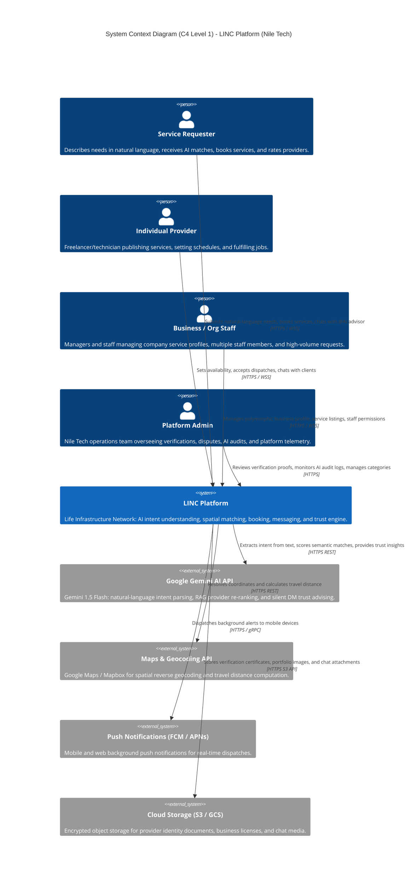

---

### 1.2 C4 Level 2: Container & Services Architecture Diagram

LINC utilizes an NPM Workspaces monorepo architecture (`client/`, `server/`, `shared/`) following a strict 4-layer clean architecture (`Routes → Controller → Service → Repository`).

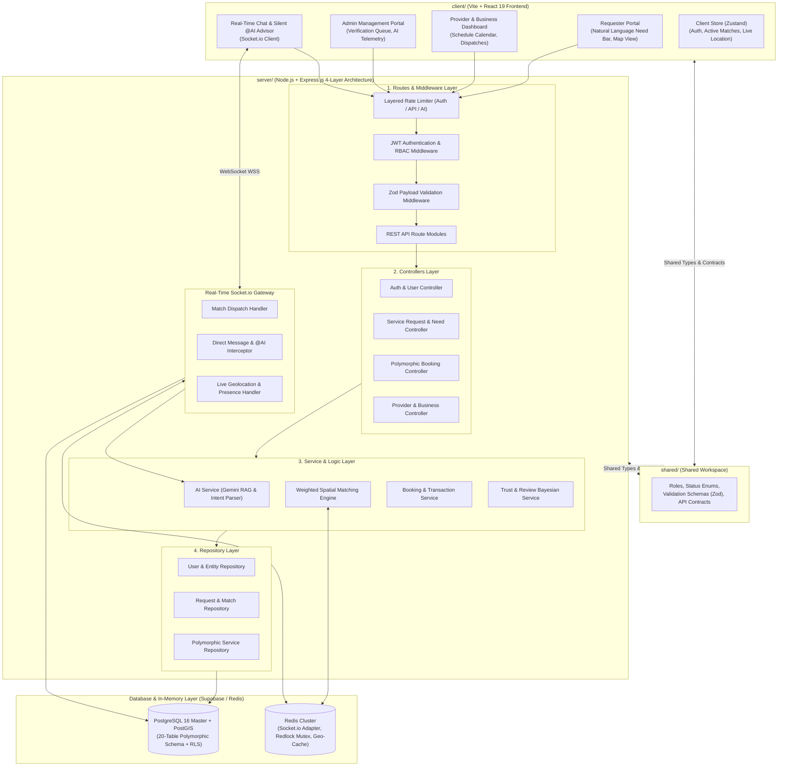

---

### 1.3 Production Deployment & Infrastructure Topology

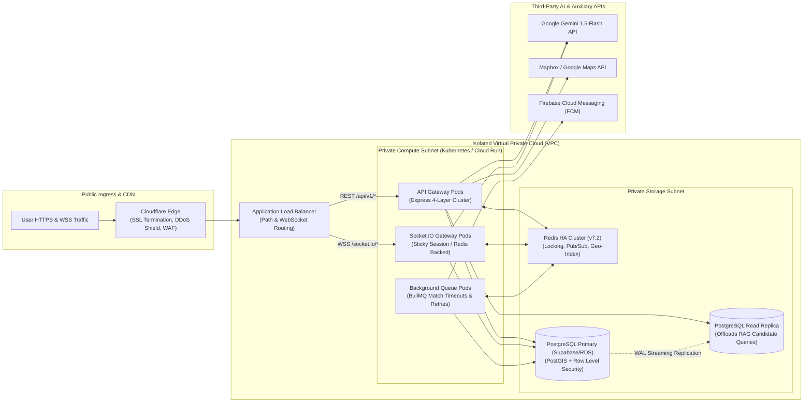

---

## 2. Data Architecture & Schema Design

### 2.1 Complete Polymorphic Entity Relationship Diagram (ERD)

LINC uses a normalized, 20-table schema supporting individual providers, corporate businesses, and community organizations with polymorphic relations for services, bookings, and reviews.

```mermaid
erDiagram
    USERS ||--o| PROVIDER_PROFILES : "extends (1:1)"
    USERS ||--o{ BUSINESS_MEMBERS : "belongs to (1:N)"
    USERS ||--o{ SERVICE_REQUESTS : "creates (1:N)"
    USERS ||--o{ BOOKINGS : "books as client (1:N)"
    USERS ||--o{ MESSAGES : "sends (1:N)"
    USERS ||--o{ REVIEWS : "writes (1:N)"
    USERS ||--o{ AUDIT_LOGS : "triggers (1:N)"

    BUSINESSES ||--o{ BUSINESS_MEMBERS : "has staff (1:N)"
    ORGANIZATIONS ||--o{ BUSINESS_MEMBERS : "has representatives (1:N)"

    PROVIDER_PROFILES ||--o{ SERVICES : "publishes (polymorphic)"
    BUSINESSES ||--o{ SERVICES : "publishes (polymorphic)"
    ORGANIZATIONS ||--o{ SERVICES : "publishes (polymorphic)"

    CATEGORIES ||--o{ SERVICES : "classifies (1:N)"
    CATEGORIES ||--o{ SERVICE_REQUESTS : "categorizes (1:N)"

    SERVICE_REQUESTS ||--o{ MATCHES : "generates candidates (1:N)"
    SERVICE_REQUESTS ||--o| BOOKINGS : "converts to (0:1)"

    SERVICES ||--o{ BOOKINGS : "booked for (1:N)"
    BOOKINGS ||--o| REVIEWS : "evaluated by (1:1)"
    BOOKINGS ||--o{ MESSAGES : "contains chat room (1:N)"

    MATCHES ||--o{ MESSAGES : "pre-booking chat (1:N)"

    USERS {
        uuid id PK "gen_random_uuid()"
        varchar email UK "Indexed"
        varchar password_hash "Bcrypt"
        varchar full_name
        varchar phone_number
        varchar role "requester | provider | business_owner | org_rep | admin"
        geometry location "POINT(4326), GiST Indexed"
        varchar avatar_url
        boolean is_active "Default true"
        timestamptz created_at
        timestamptz updated_at
    }

    PROVIDER_PROFILES {
        uuid id PK "gen_random_uuid()"
        uuid user_id FK,UK "References users(id) ON DELETE CASCADE"
        varchar title "e.g. Master Electrician"
        text bio
        jsonb skills "GIN Indexed string array"
        float average_rating "Bayesian smoothed (1.0-5.0)"
        int total_reviews "Default 0"
        jsonb availability "Weekly calendar matrix"
        int max_concurrent_jobs "Default 1"
        int active_jobs_count "Default 0"
        boolean is_verified "Default false (Admin controlled)"
        boolean is_online "Live presence flag"
        timestamptz created_at
        timestamptz updated_at
    }

    BUSINESSES {
        uuid id PK "gen_random_uuid()"
        uuid owner_id FK "References users(id)"
        varchar business_name "Unique registered name"
        varchar registration_number
        text description
        varchar category
        geometry location "POINT(4326)"
        varchar contact_email
        varchar contact_phone
        boolean is_verified "Default false"
        float average_rating "Default 0.0"
        int total_reviews "Default 0"
        timestamptz created_at
        timestamptz updated_at
    }

    ORGANIZATIONS {
        uuid id PK "gen_random_uuid()"
        uuid primary_contact_id FK "References users(id)"
        varchar org_name
        varchar org_type "NGO | Community | Government | Academic"
        text mission_statement
        geometry location "POINT(4326)"
        boolean is_verified "Default false"
        timestamptz created_at
    }

    BUSINESS_MEMBERS {
        uuid id PK "gen_random_uuid()"
        uuid user_id FK "References users(id)"
        varchar entity_type "CHECK in ('business','organization')"
        uuid entity_id "References businesses(id) or organizations(id)"
        varchar member_role "owner | manager | staff | technician"
        timestamptz joined_at
    }

    CATEGORIES {
        uuid id PK "gen_random_uuid()"
        varchar name UK "e.g. Home Repair, Tech, Health"
        varchar slug UK
        text description
        varchar icon_name
        uuid parent_id FK "Self-referencing for sub-categories"
    }

    SERVICES {
        uuid id PK "gen_random_uuid()"
        varchar entity_type "CHECK in ('provider','business','organization')"
        uuid entity_id "Polymorphic FK"
        uuid category_id FK "References categories(id)"
        varchar title "Service title"
        text description "Detailed scope"
        numeric price_estimate "Decimal(10,2)"
        varchar pricing_model "fixed | hourly | quote"
        geometry service_area "POLYGON(4326) or Center POINT"
        boolean is_active "Default true"
        timestamptz created_at
    }

    SERVICE_REQUESTS {
        uuid id PK "gen_random_uuid()"
        uuid client_id FK "References users(id)"
        uuid category_id FK "References categories(id)"
        text raw_user_prompt "Original natural-language input"
        jsonb ai_extracted_intent "Category, Urgency, Budget, Keywords"
        geometry service_location "POINT(4326), GiST Indexed"
        varchar urgency "immediate | today | scheduled | flexible"
        numeric budget_max "Decimal(10,2)"
        varchar status "pending | understanding | matching | dispatched | booked | completed | cancelled"
        timestamptz requested_time
        timestamptz created_at
        timestamptz updated_at
    }

    MATCHES {
        uuid id PK "gen_random_uuid()"
        uuid request_id FK "References service_requests(id) ON DELETE CASCADE"
        varchar candidate_type "provider | business | organization"
        uuid candidate_id "Polymorphic Provider / Business ID"
        float match_score "0.0 - 100.0"
        jsonb score_breakdown "Proximity, Rating, Availability, Skills, AI Re-rank"
        text ai_recommendation_reason "Gemini RAG generated rationale"
        varchar status "pending | accepted | rejected | expired"
        timestamptz expires_at "Indexed TTL"
        timestamptz created_at
    }

    BOOKINGS {
        uuid id PK "gen_random_uuid()"
        uuid request_id FK "References service_requests(id)"
        uuid service_id FK "References services(id)"
        uuid client_id FK "References users(id)"
        varchar entity_type "provider | business | organization"
        uuid entity_id "Assigned Entity ID"
        timestamptz scheduled_start
        timestamptz scheduled_end
        numeric total_amount "Decimal(10,2)"
        varchar status "requested | confirmed | in_progress | completed | cancelled | disputed"
        timestamptz created_at
        timestamptz updated_at
    }

    MESSAGES {
        uuid id PK "gen_random_uuid()"
        varchar context_type "match | booking"
        uuid context_id "References matches(id) or bookings(id)"
        uuid sender_id FK "References users(id)"
        text content "Message body"
        boolean is_ai_query "True if @AI trust advisor invocation"
        jsonb ai_response_data "Private advisor summary for requester"
        boolean is_read "Default false"
        timestamptz sent_at
    }

    REVIEWS {
        uuid id PK "gen_random_uuid()"
        uuid booking_id FK,UK "References bookings(id) ON DELETE CASCADE"
        uuid reviewer_id FK "References users(id)"
        varchar target_entity_type "provider | business"
        uuid target_entity_id "Polymorphic Target ID"
        int rating "CHECK (rating BETWEEN 1 AND 5)"
        text comment
        timestamptz created_at
    }

    AUDIT_LOGS {
        uuid id PK "gen_random_uuid()"
        uuid actor_id FK "References users(id)"
        varchar action "e.g. AI_INTENT_PARSED, VERIFICATION_APPROVED"
        varchar entity_type
        uuid entity_id
        jsonb metadata "Payload snapshot"
        timestamptz created_at
    }
```

---

### 2.2 PostgreSQL + PostGIS Production DDL & Indexes

```sql
-- PostgreSQL 16 / PostGIS Production DDL for LINC (Nile Tech)
CREATE EXTENSION IF NOT EXISTS "uuid-ossp";
CREATE EXTENSION IF NOT EXISTS "postgis";
CREATE EXTENSION IF NOT EXISTS "pg_trgm";

-- 1. USERS
CREATE TABLE users (
    id UUID PRIMARY KEY DEFAULT gen_random_uuid(),
    email VARCHAR(255) UNIQUE NOT NULL,
    password_hash VARCHAR(255) NOT NULL,
    full_name VARCHAR(100) NOT NULL,
    phone_number VARCHAR(30),
    role VARCHAR(30) NOT NULL DEFAULT 'requester' 
        CHECK (role IN ('requester', 'provider', 'business_owner', 'org_rep', 'admin')),
    location GEOMETRY(Point, 4326),
    avatar_url VARCHAR(500),
    is_active BOOLEAN NOT NULL DEFAULT TRUE,
    created_at TIMESTAMPTZ NOT NULL DEFAULT NOW(),
    updated_at TIMESTAMPTZ NOT NULL DEFAULT NOW()
);

CREATE INDEX idx_users_email ON users(email);
CREATE INDEX idx_users_role ON users(role);
CREATE INDEX idx_users_location_gist ON users USING GIST (location);

-- 2. PROVIDER PROFILES
CREATE TABLE provider_profiles (
    id UUID PRIMARY KEY DEFAULT gen_random_uuid(),
    user_id UUID UNIQUE NOT NULL REFERENCES users(id) ON DELETE CASCADE,
    title VARCHAR(150) NOT NULL,
    bio TEXT,
    skills JSONB NOT NULL DEFAULT '[]'::jsonb,
    average_rating FLOAT NOT NULL DEFAULT 0.0 CHECK (average_rating >= 0.0 AND average_rating <= 5.0),
    total_reviews INT NOT NULL DEFAULT 0 CHECK (total_reviews >= 0),
    availability JSONB NOT NULL DEFAULT '{}'::jsonb,
    max_concurrent_jobs INT NOT NULL DEFAULT 1 CHECK (max_concurrent_jobs >= 1),
    active_jobs_count INT NOT NULL DEFAULT 0 CHECK (active_jobs_count >= 0),
    is_verified BOOLEAN NOT NULL DEFAULT FALSE,
    is_online BOOLEAN NOT NULL DEFAULT FALSE,
    created_at TIMESTAMPTZ NOT NULL DEFAULT NOW(),
    updated_at TIMESTAMPTZ NOT NULL DEFAULT NOW()
);

CREATE INDEX idx_providers_user_id ON provider_profiles(user_id);
CREATE INDEX idx_providers_skills_gin ON provider_profiles USING GIN (skills);
CREATE INDEX idx_providers_status ON provider_profiles(is_verified, is_online);

-- 3. BUSINESSES & ORGANIZATIONS
CREATE TABLE businesses (
    id UUID PRIMARY KEY DEFAULT gen_random_uuid(),
    owner_id UUID NOT NULL REFERENCES users(id) ON DELETE RESTRICT,
    business_name VARCHAR(200) UNIQUE NOT NULL,
    registration_number VARCHAR(100),
    description TEXT,
    category VARCHAR(100) NOT NULL,
    location GEOMETRY(Point, 4326),
    contact_email VARCHAR(255),
    contact_phone VARCHAR(50),
    is_verified BOOLEAN NOT NULL DEFAULT FALSE,
    average_rating FLOAT NOT NULL DEFAULT 0.0,
    total_reviews INT NOT NULL DEFAULT 0,
    created_at TIMESTAMPTZ NOT NULL DEFAULT NOW(),
    updated_at TIMESTAMPTZ NOT NULL DEFAULT NOW()
);

CREATE INDEX idx_businesses_location_gist ON businesses USING GIST (location);

CREATE TABLE organizations (
    id UUID PRIMARY KEY DEFAULT gen_random_uuid(),
    primary_contact_id UUID NOT NULL REFERENCES users(id) ON DELETE RESTRICT,
    org_name VARCHAR(200) NOT NULL,
    org_type VARCHAR(50) NOT NULL CHECK (org_type IN ('NGO', 'Community', 'Government', 'Academic')),
    mission_statement TEXT,
    location GEOMETRY(Point, 4326),
    is_verified BOOLEAN NOT NULL DEFAULT FALSE,
    created_at TIMESTAMPTZ NOT NULL DEFAULT NOW()
);

-- 4. BUSINESS MEMBERS
CREATE TABLE business_members (
    id UUID PRIMARY KEY DEFAULT gen_random_uuid(),
    user_id UUID NOT NULL REFERENCES users(id) ON DELETE CASCADE,
    entity_type VARCHAR(30) NOT NULL CHECK (entity_type IN ('business', 'organization')),
    entity_id UUID NOT NULL,
    member_role VARCHAR(30) NOT NULL CHECK (member_role IN ('owner', 'manager', 'staff', 'technician')),
    joined_at TIMESTAMPTZ NOT NULL DEFAULT NOW(),
    CONSTRAINT uq_member_entity UNIQUE (user_id, entity_type, entity_id)
);

-- 5. CATEGORIES
CREATE TABLE categories (
    id UUID PRIMARY KEY DEFAULT gen_random_uuid(),
    name VARCHAR(100) UNIQUE NOT NULL,
    slug VARCHAR(100) UNIQUE NOT NULL,
    description TEXT,
    icon_name VARCHAR(50),
    parent_id UUID REFERENCES categories(id) ON DELETE SET NULL
);

-- 6. POLYMORPHIC SERVICES
CREATE TABLE services (
    id UUID PRIMARY KEY DEFAULT gen_random_uuid(),
    entity_type VARCHAR(30) NOT NULL CHECK (entity_type IN ('provider', 'business', 'organization')),
    entity_id UUID NOT NULL,
    category_id UUID NOT NULL REFERENCES categories(id) ON DELETE RESTRICT,
    title VARCHAR(200) NOT NULL,
    description TEXT NOT NULL,
    price_estimate NUMERIC(10, 2),
    pricing_model VARCHAR(30) NOT NULL DEFAULT 'quote' CHECK (pricing_model IN ('fixed', 'hourly', 'quote')),
    service_area GEOMETRY(Geometry, 4326),
    is_active BOOLEAN NOT NULL DEFAULT TRUE,
    created_at TIMESTAMPTZ NOT NULL DEFAULT NOW()
);

CREATE INDEX idx_services_category ON services(category_id);
CREATE INDEX idx_services_entity ON services(entity_type, entity_id);

-- 7. SERVICE REQUESTS (NATURAL-LANGUAGE INGESTION)
CREATE TABLE service_requests (
    id UUID PRIMARY KEY DEFAULT gen_random_uuid(),
    client_id UUID NOT NULL REFERENCES users(id) ON DELETE RESTRICT,
    category_id UUID REFERENCES categories(id) ON DELETE SET NULL,
    raw_user_prompt TEXT NOT NULL,
    ai_extracted_intent JSONB NOT NULL DEFAULT '{}'::jsonb,
    service_location GEOMETRY(Point, 4326) NOT NULL,
    urgency VARCHAR(30) NOT NULL DEFAULT 'flexible' 
        CHECK (urgency IN ('immediate', 'today', 'scheduled', 'flexible')),
    budget_max NUMERIC(10, 2),
    status VARCHAR(30) NOT NULL DEFAULT 'pending' 
        CHECK (status IN ('pending', 'understanding', 'matching', 'dispatched', 'booked', 'completed', 'cancelled')),
    requested_time TIMESTAMPTZ NOT NULL DEFAULT NOW(),
    created_at TIMESTAMPTZ NOT NULL DEFAULT NOW(),
    updated_at TIMESTAMPTZ NOT NULL DEFAULT NOW()
);

CREATE INDEX idx_requests_client ON service_requests(client_id);
CREATE INDEX idx_requests_status ON service_requests(status);
CREATE INDEX idx_requests_location_gist ON service_requests USING GIST (service_location);

-- 8. MATCHES TABLE
CREATE TABLE matches (
    id UUID PRIMARY KEY DEFAULT gen_random_uuid(),
    request_id UUID NOT NULL REFERENCES service_requests(id) ON DELETE CASCADE,
    candidate_type VARCHAR(30) NOT NULL CHECK (candidate_type IN ('provider', 'business', 'organization')),
    candidate_id UUID NOT NULL,
    match_score FLOAT NOT NULL CHECK (match_score >= 0.0 AND match_score <= 100.0),
    score_breakdown JSONB NOT NULL DEFAULT '{}'::jsonb,
    ai_recommendation_reason TEXT,
    status VARCHAR(30) NOT NULL DEFAULT 'pending' 
        CHECK (status IN ('pending', 'accepted', 'rejected', 'expired')),
    expires_at TIMESTAMPTZ NOT NULL,
    created_at TIMESTAMPTZ NOT NULL DEFAULT NOW(),
    CONSTRAINT uq_request_candidate UNIQUE (request_id, candidate_type, candidate_id)
);

CREATE INDEX idx_matches_request_status ON matches(request_id, status);
CREATE INDEX idx_matches_expires_at ON matches(expires_at) WHERE status = 'pending';

-- 9. BOOKINGS TABLE
CREATE TABLE bookings (
    id UUID PRIMARY KEY DEFAULT gen_random_uuid(),
    request_id UUID REFERENCES service_requests(id) ON DELETE SET NULL,
    service_id UUID REFERENCES services(id) ON DELETE SET NULL,
    client_id UUID NOT NULL REFERENCES users(id) ON DELETE RESTRICT,
    entity_type VARCHAR(30) NOT NULL CHECK (entity_type IN ('provider', 'business', 'organization')),
    entity_id UUID NOT NULL,
    scheduled_start TIMESTAMPTZ NOT NULL,
    scheduled_end TIMESTAMPTZ,
    total_amount NUMERIC(10, 2),
    status VARCHAR(30) NOT NULL DEFAULT 'requested' 
        CHECK (status IN ('requested', 'confirmed', 'in_progress', 'completed', 'cancelled', 'disputed')),
    created_at TIMESTAMPTZ NOT NULL DEFAULT NOW(),
    updated_at TIMESTAMPTZ NOT NULL DEFAULT NOW()
);

CREATE INDEX idx_bookings_client ON bookings(client_id);
CREATE INDEX idx_bookings_entity ON bookings(entity_type, entity_id);
CREATE INDEX idx_bookings_status ON bookings(status);

-- 10. MESSAGES & SILENT AI ADVISOR
CREATE TABLE messages (
    id UUID PRIMARY KEY DEFAULT gen_random_uuid(),
    context_type VARCHAR(30) NOT NULL CHECK (context_type IN ('match', 'booking')),
    context_id UUID NOT NULL,
    sender_id UUID NOT NULL REFERENCES users(id) ON DELETE RESTRICT,
    content TEXT NOT NULL,
    is_ai_query BOOLEAN NOT NULL DEFAULT FALSE,
    ai_response_data JSONB,
    is_read BOOLEAN NOT NULL DEFAULT FALSE,
    sent_at TIMESTAMPTZ NOT NULL DEFAULT NOW()
);

CREATE INDEX idx_messages_context ON messages(context_type, context_id, sent_at ASC);

-- 11. REVIEWS
CREATE TABLE reviews (
    id UUID PRIMARY KEY DEFAULT gen_random_uuid(),
    booking_id UUID UNIQUE NOT NULL REFERENCES bookings(id) ON DELETE CASCADE,
    reviewer_id UUID NOT NULL REFERENCES users(id) ON DELETE RESTRICT,
    target_entity_type VARCHAR(30) NOT NULL CHECK (target_entity_type IN ('provider', 'business')),
    target_entity_id UUID NOT NULL,
    rating INT NOT NULL CHECK (rating BETWEEN 1 AND 5),
    comment TEXT,
    created_at TIMESTAMPTZ NOT NULL DEFAULT NOW()
);

CREATE INDEX idx_reviews_target ON reviews(target_entity_type, target_entity_id);
```

---

### 2.3 Row Level Security (RLS) Policies & Triggers

```sql
-- Enable Row Level Security across all core tables
ALTER TABLE users ENABLE ROW LEVEL SECURITY;
ALTER TABLE provider_profiles ENABLE ROW LEVEL SECURITY;
ALTER TABLE businesses ENABLE ROW LEVEL SECURITY;
ALTER TABLE service_requests ENABLE ROW LEVEL SECURITY;
ALTER TABLE matches ENABLE ROW LEVEL SECURITY;
ALTER TABLE bookings ENABLE ROW LEVEL SECURITY;
ALTER TABLE messages ENABLE ROW LEVEL SECURITY;
ALTER TABLE reviews ENABLE ROW LEVEL SECURITY;

-- 1. USERS RLS
CREATE POLICY users_self_view ON users FOR SELECT USING (auth.uid() = id);
CREATE POLICY users_admin_all ON users FOR ALL USING (EXISTS (SELECT 1 FROM users WHERE id = auth.uid() AND role = 'admin'));
CREATE POLICY users_self_update ON users FOR UPDATE USING (auth.uid() = id) WITH CHECK (auth.uid() = id);

-- 2. SERVICE REQUESTS RLS
CREATE POLICY requests_client_access ON service_requests FOR ALL 
    USING (auth.uid() = client_id) 
    WITH CHECK (auth.uid() = client_id);

CREATE POLICY requests_matched_entity_read ON service_requests FOR SELECT 
    USING (
        id IN (
            SELECT request_id FROM matches m
            JOIN provider_profiles p ON m.candidate_id = p.id AND m.candidate_type = 'provider'
            WHERE p.user_id = auth.uid()
        )
    );

-- 3. MESSAGES RLS (WITH PRIVATE @AI VIEW SECURITY)
CREATE POLICY messages_participants_access ON messages FOR ALL
    USING (
        (context_type = 'booking' AND context_id IN (
            SELECT id FROM bookings WHERE client_id = auth.uid() 
            OR (entity_type = 'provider' AND entity_id IN (SELECT id FROM provider_profiles WHERE user_id = auth.uid()))
        ))
        OR
        (context_type = 'match' AND context_id IN (
            SELECT m.id FROM matches m
            JOIN service_requests sr ON sr.id = m.request_id
            WHERE sr.client_id = auth.uid() 
            OR (m.candidate_type = 'provider' AND m.candidate_id IN (SELECT id FROM provider_profiles WHERE user_id = auth.uid()))
        ))
    )
    WITH CHECK (auth.uid() = sender_id);
```

---

## 3. Object-Oriented & Domain Class Architecture

### 3.1 Core Domain Entities Class Diagram

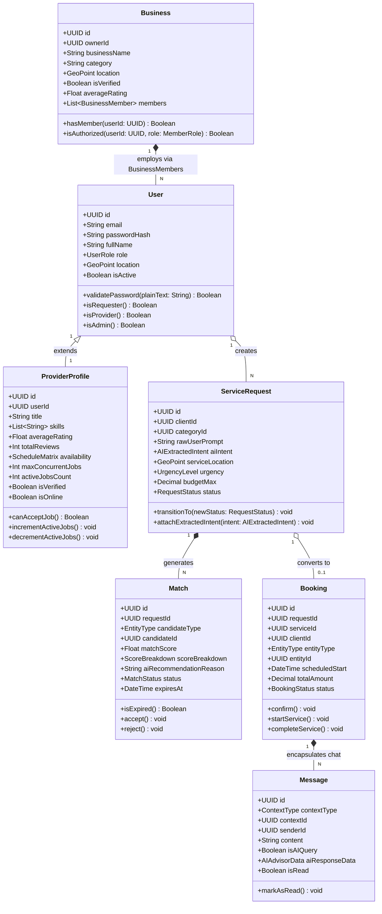

---

### 3.2 4-Layer Clean Architecture & Gemini RAG Class Hierarchy

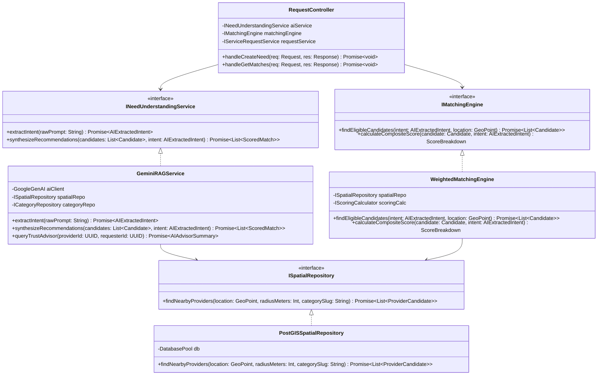

---

### 3.3 Real-Time WebSocket & Silent AI Trust Advisor Class Diagram

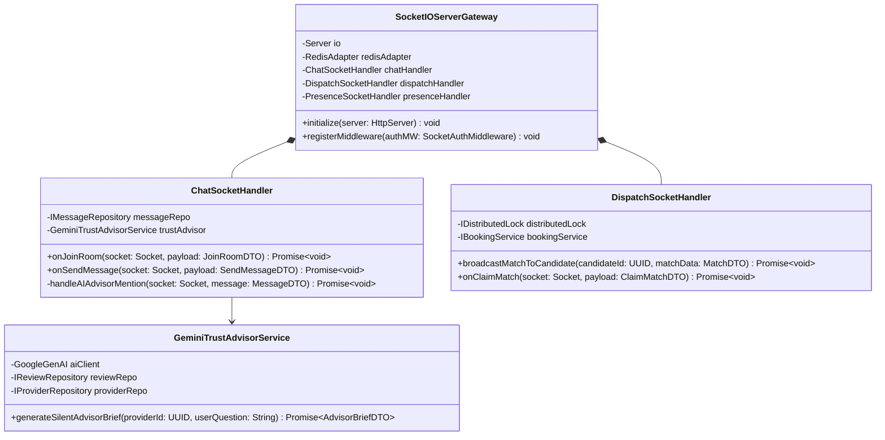

---

## 4. State Machines & Lifecycle Models

### 4.1 Service Request Lifecycle State Machine

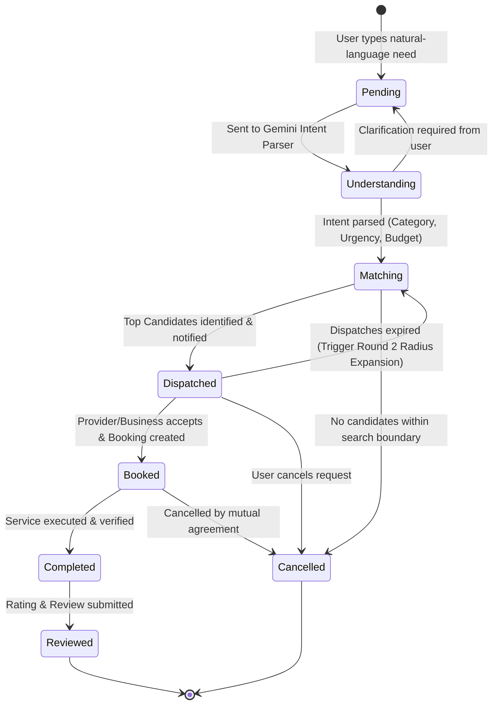

---

### 4.2 Booking & Fulfillment Lifecycle State Machine

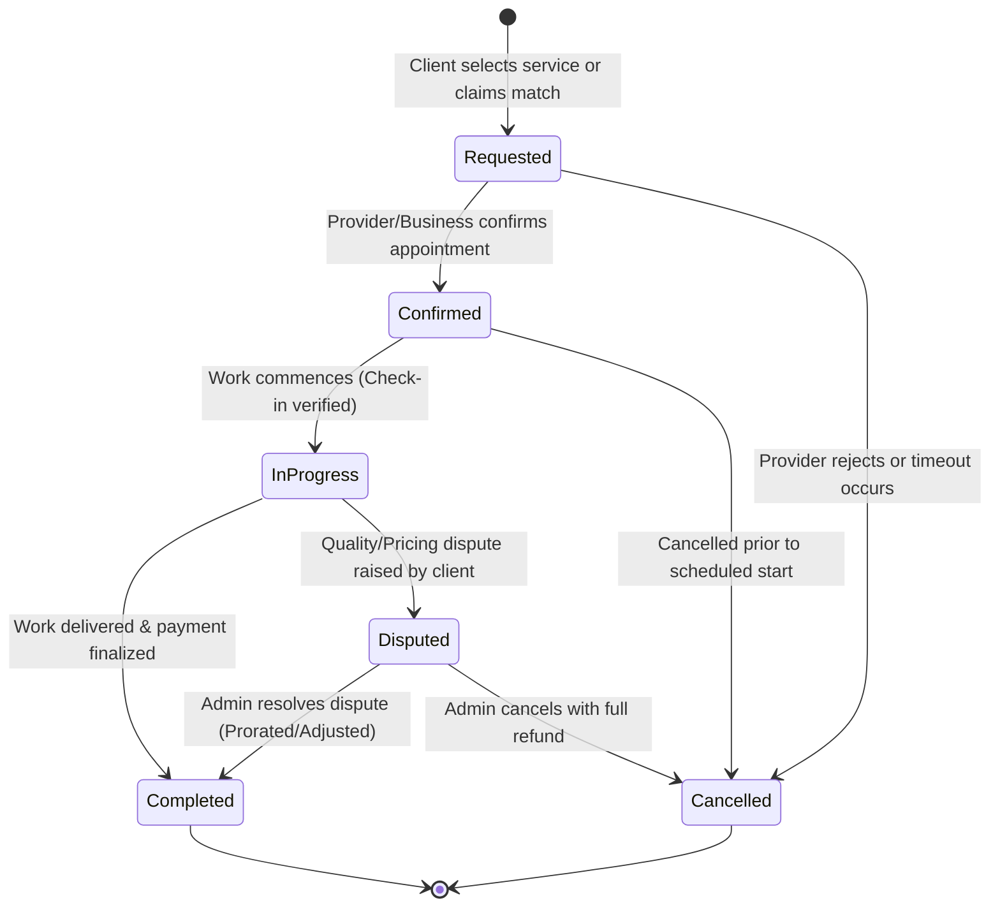

---

### 4.3 Match Candidate Lifecycle State Machine

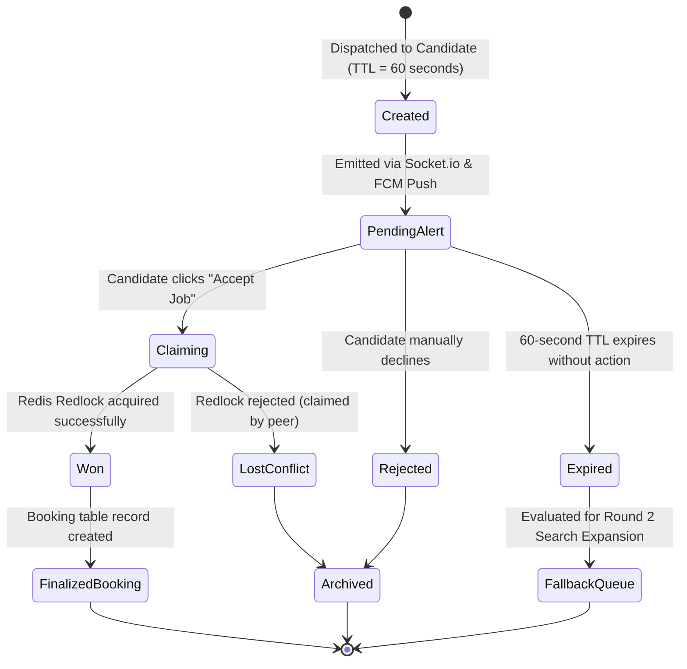

---

## 5. End-to-End System Sequence Diagrams

### 5.1 Sequence 1: Natural-Language "Need Understanding" & Gemini RAG Matching Workflow

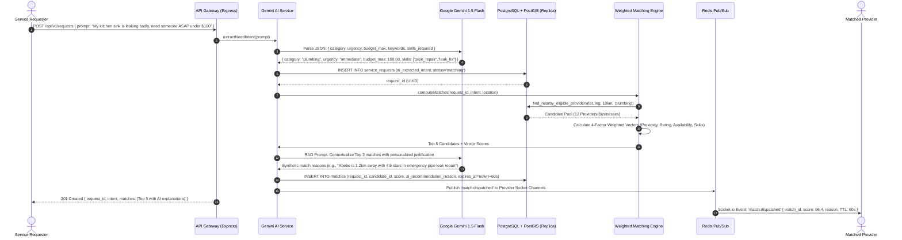

---

### 5.2 Sequence 2: Polymorphic Match Claim & Booking Confirmation (Redis Mutex)

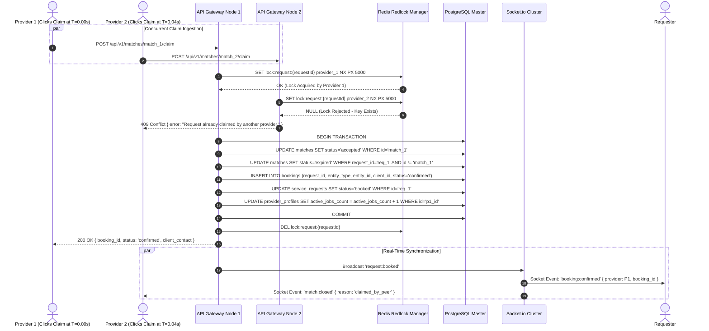

---

### 5.3 Sequence 3: Real-Time Chat with Silent `@AI` Trust Advisor Workflow

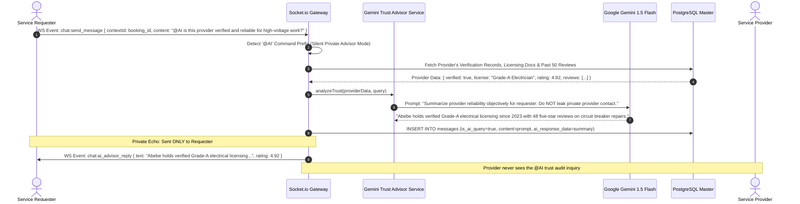

---

### 5.4 Sequence 4: Provider & Business Verification Lifecycle

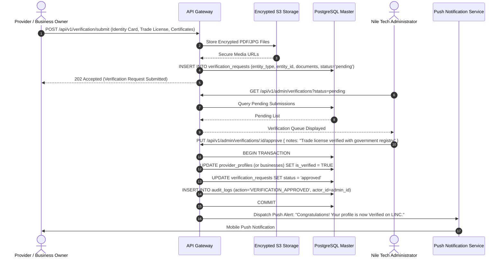

---

## 6. Intelligent Weighted Matching & AI Pipeline

### 6.1 AI Need Understanding & RAG Pipeline Flowchart

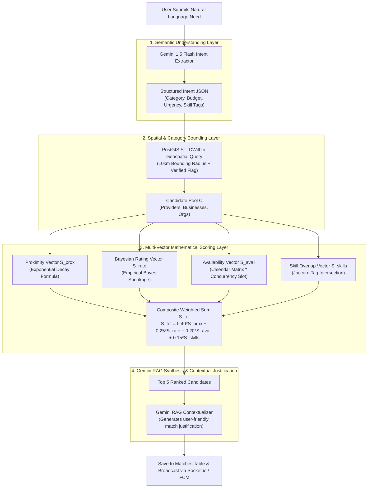

---

### 6.2 Mathematical Scoring Formulation & Vectors

The composite match score $S_{\text{total}} \in [0.0, 100.0]$ is computed as:

$$S_{\text{total}} = w_1 S_{\text{proximity}} + w_2 S_{\text{rating}} + w_3 S_{\text{availability}} + w_4 S_{\text{skills}}$$

$$\sum_{i=1}^{4} w_i = 0.40 + 0.25 + 0.20 + 0.15 = 1.00$$

| Factor | Weight ($w_i$) | Scale | Formula & Parameters |
| :--- | :---: | :---: | :--- |
| **Proximity ($S_{\text{proximity}}$)** | **0.40** | $0-100$ | $S_{\text{proximity}} = 100 \cdot e^{-\lambda d}$, where $\lambda = 0.69315$ (half-life at $d = 1.0\text{ km}$) |
| **Bayesian Rating ($S_{\text{rating}}$)** | **0.25** | $0-100$ | $S_{\text{rating}} = 100 \cdot \left( \frac{R_{\text{bayes}} - 1.0}{4.0} \right)$, where $R_{\text{bayes}} = \frac{n \cdot \bar{R} + C \cdot \mu}{n + C}$ ($C=10, \mu=4.2$) |
| **Availability ($S_{\text{availability}}$)** | **0.20** | $0-100$ | $S_{\text{availability}} = 100 \cdot A_{\text{online}} \cdot A_{\text{schedule}}(t) \cdot \left(1.0 - \frac{\text{active\_jobs}}{\text{max\_jobs}}\right)$ |
| **Skill Relevance ($S_{\text{skills}}$)** | **0.15** | $0-100$ | $S_{\text{skills}} = 100 \cdot \frac{\|P \cap R\|}{\|P \cup R\|}$ (Jaccard Tag Similarity Index) |

---

## 7. API Gateway, WebSocket & RBAC Specifications

### 7.1 REST API Endpoints Specification

| Method | Endpoint | Auth Level | Request Payload | Response Schema (Success 200/201) |
| :--- | :--- | :--- | :--- | :--- |
| `POST` | `/api/v1/auth/register` | Public | `{ email, password, fullName, role }` | `{ user: { id, email, role }, token }` |
| `POST` | `/api/v1/auth/login` | Public | `{ email, password }` | `{ user: { id, role }, token, refreshToken }` |
| `POST` | `/api/v1/requests` | Requester | `{ prompt, location: {lat,lng}, urgency, budgetMax }` | `{ request: { id, status }, aiIntent: {...}, matches: [...] }` |
| `GET` | `/api/v1/requests/:id` | Auth | *None* | `{ request: { id, status, client, matches: [...] } }` |
| `POST` | `/api/v1/matches/:id/claim` | Provider | *None* | `{ match: { id, status: 'accepted' }, booking: { id } }` |
| `POST` | `/api/v1/bookings` | Requester | `{ serviceId, entityType, entityId, scheduledStart }` | `{ booking: { id, status: 'requested' } }` |
| `PUT` | `/api/v1/bookings/:id/confirm`| Provider | *None* | `{ booking: { id, status: 'confirmed' } }` |
| `POST` | `/api/v1/reviews` | Requester | `{ bookingId, rating, comment }` | `{ review: { id, rating, comment, createdAt } }` |
| `POST` | `/api/v1/verification/submit`| Provider | `FormData: { documents, idType }` | `{ verificationId, status: 'pending' }` |
| `PUT` | `/api/v1/admin/verifications/:id/approve` | Admin | `{ notes }` | `{ verificationId, status: 'approved' }` |

---

### 7.2 Real-Time Socket.io Event Catalog

```typescript
// Socket.io Client to Server Protocol
interface ClientToServerEvents {
  "presence:heartbeat": (payload: { lat: number; lng: number; isOnline: boolean }) => void;
  "chat:join": (payload: { contextType: "match" | "booking"; contextId: string }) => void;
  "chat:send": (payload: { contextType: "match" | "booking"; contextId: string; content: string }) => void;
  "match:claim": (payload: { matchId: string }) => void;
}

// Socket.io Server to Client Protocol
interface ServerToClientEvents {
  "match:dispatched": (payload: {
    matchId: string;
    requestId: string;
    score: number;
    aiRecommendationReason: string;
    expiresAt: string;
    requestSummary: { category: string; urgency: string; distanceMeters: number };
  }) => void;
  "booking:confirmed": (payload: { bookingId: string; providerInfo: object }) => void;
  "chat:new_message": (payload: { id: string; senderId: string; content: string; sentAt: string }) => void;
  "chat:ai_advisor_reply": (payload: { text: string; confidenceScore: number; verifiedBadge: boolean }) => void;
}
```

---

### 7.3 Role-Based Access Control (RBAC) Matrix

| Platform Action / Resource | Requester | Individual Provider | Business Staff | Platform Admin | Enforcement Layer |
| :--- | :---: | :---: | :---: | :---: | :--- |
| **Create Natural Language Request** | **Allowed** | Denied | Denied | Denied | JWT Role Guard |
| **Receive & Claim Match Dispatch** | Denied | **Allowed** | **Allowed** | Denied | Redis Redlock Mutex |
| **Publish Polymorphic Service** | Denied | **Allowed** | **Allowed** | **Allowed** | Database RLS Policy |
| **Invoke Silent `@AI` Trust Advisor** | **Allowed** | Denied | Denied | **Allowed** | Socket.io Handler Check |
| **Approve Identity Verification** | Denied | Denied | Denied | **Allowed** | Admin RBAC Middleware |
| **Access Real-Time Match Chat Room** | **Allowed (Own)**| **Allowed (Own)**| **Allowed (Own)**| **Allowed (All)**| Match Membership Validator |

---

## 8. Scalability, Performance & Reliability Strategy

### 8.1 Spatial Indexing: PostGIS vs. Uber H3

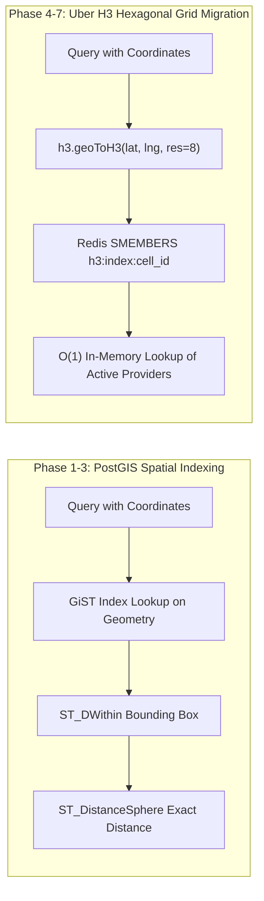

- **PostGIS Strategy:** Optimal for sub-100,000 active service listings with rich polygon service boundaries and strict relational integrity.
- **Uber H3 Migration Strategy:** When scaling beyond 1,000,000 real-time location pings, provider locations are hashed into H3 Resolution 8 cells (~460m diameter) stored in Redis sets, reducing spatial lookup complexity from $O(\log N)$ to $O(1)$.

---

### 8.2 Caching Strategy, Rate Limiting & Concurrency

1. **Layered Rate Limiting:**
   - Public Auth Endpoints (`/api/v1/auth/*`): 10 requests / min / IP.
   - Standard CRUD Endpoints (`/api/v1/*`): 120 requests / min / User.
   - Expensive AI Endpoints (`/api/v1/requests` & `@AI` in chat): 15 requests / min / User (backed by Redis Token Bucket).
2. **Distributed Mutex with Redis Redlock:** Prevents double booking when multiple providers attempt to claim a dispatched match simultaneously.
3. **Connection Pooling with PgBouncer:** Ensures PostgreSQL handles 5,000+ concurrent clients without connection starvation.

---

### 8.3 Observability & Monitoring Pipeline

- **Structured Logging:** Winston logger outputting JSON with correlation IDs (`requestId`, `userId`, `traceId`).
- **Distributed Tracing:** OpenTelemetry spans tracking request duration from API ingress $\to$ Gemini API latency $\to$ PostgreSQL query execution.
- **Health Checks & Telemetry:** `/api/health` checking database connectivity, Redis ping, and Gemini API quota headroom.

---

## 9. Nile Tech Monorepo Structure & Engineering Roadmap

### 9.1 NPM Workspaces Monorepo Layout

```
linc-monorepo/
├── package.json                  # NPM Workspaces root config ("client", "server", "shared")
├── shared/                       # Shared Constants, Types & Validation Schemas
│   ├── src/
│   │   ├── constants/            # Roles, UrgencyLevels, BookingStatuses
│   │   ├── types/                # Domain TypeScript Interfaces
│   │   └── schemas/              # Zod validation schemas (shared between client & server)
├── client/                       # React 19 + Vite Frontend
│   ├── src/
│   │   ├── api/                  # Axios HTTP client with JWT interceptors
│   │   ├── components/           # UI Design System (NeedInput, MatchCard, ChatWindow)
│   │   ├── hooks/                # useSocket, useGeolocation, useAuth
│   │   ├── store/                # Zustand client state stores
│   │   └── App.tsx
├── server/                       # Express.js Backend (4-Layer Clean Architecture)
│   ├── src/
│   │   ├── routes/               # Express Route Definitions
│   │   ├── controllers/          # Controllers (Auth, Request, Booking, Provider)
│   │   ├── services/             # Logic Services (Gemini AI RAG, Matching, Trust)
│   │   ├── repositories/         # Database Repositories (PostgreSQL / Supabase)
│   │   ├── sockets/              # Socket.io Event Gateways & Handlers
│   │   └── server.ts             # Server entry point
├── supabase/                     # Database Migrations & Security
│   ├── migrations/               # 20-Table SQL DDL & PostGIS Functions
│   └── security/                 # Row Level Security (RLS) policies
├── SYSTEM_DESIGN.md              # Master System Architecture Document
└── README.md
```

---

### 9.2 Nile Tech 7-Phase Development Roadmap

| Phase | Milestone Name | Key Engineering Deliverables | Owner |
| :---: | :--- | :--- | :--- |
| **1** | **Foundation** | Monorepo setup, Supabase 20-table schema, JWT auth, RBAC middleware | Nile Tech |
| **2** | **Core Platform** | Polymorphic provider/business profiles, service listings, category engine | Nile Tech |
| **3** | **Intelligence** | Gemini 1.5 Flash natural-language intent parsing, 4-factor matching engine | Nile Tech |
| **4** | **Connection** | Polymorphic booking system, Socket.io real-time chat, Redis distributed mutex | Nile Tech |
| **5** | **Trust & AI Advisor** | Provider verification portal, Bayesian review system, `@AI` silent DM advisor | Nile Tech |
| **6** | **Admin Dashboard** | Central verification queue, dispute resolution, AI audit logs, analytics | Nile Tech |
| **7** | **Optimization** | Uber H3 spatial migration, OpenTelemetry tracing, load testing, final polish | Nile Tech |

---

### 🌟 Concluding Architecture Statement

This document serves as the authoritative, end-to-end technical blueprint for **LINC (Life Infrastructure Network)** developed by **Nile Tech**. 

By coupling a **4-layer clean backend architecture** with **Google Gemini 1.5 Flash RAG matching**, **PostGIS spatial indexing**, **Redis distributed locking**, and **polymorphic multi-role data structures**, LINC successfully transforms the user experience from traditional manual searching into a seamless **Need → Understand → Match → Connect → Solve** ecosystem.
